# TP1 — Modèles de langage 

Exercice 1 :

1. Alexandre Galstian

2. 
bash
python -m venv .venv
source .venv/bin/activate
pip install -r TP1/requirements.txt

3. 
Python: 3.12.5
OS: Linux-6.14.0-37-generic-x86_64-with-glibc2.39
torch: 2.9.1+cpu
transformers: 4.57.3
sklearn: 1.8.0
plotly: 6.5.1

Exercice 2 :

Question 2.a : 

Tokens:
['Art', 'ificial', 'Ġintelligence', 'Ġis', 'Ġmet', 'amorph', 'osing', 'Ġthe', 'Ġworld', '!']

Lors de la tokenisation avec GPT-2, on observe que certains tokens commencent par le symbole Ġ. Ce symbole sert à indiquer que le token est précédé d’un espace dans le texte original. Cela permet au modèle de distinguer un mot en début de phrase d’un mot qui apparaît après un espace. On remarque aussi que la ponctuation, comme le point d’exclamation, est séparée en un token à part.

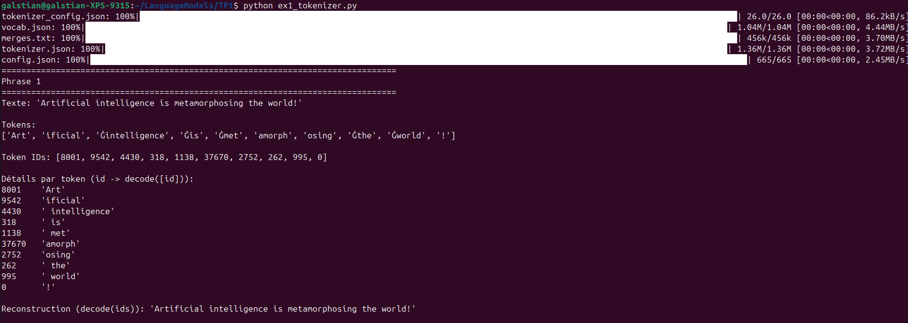

Question 2.b : 

Token IDs: [8001, 9542, 4430, 318, 1138, 37670, 2752, 262, 995, 0]

| Décodage (repr) | ID | Remarque |
|---|---:|---|
| 'Art' | 8001 | début de mot (pas d’espace) |
| 'ificial' | 9542 | continuation du mot “Artificial” |
| ' intelligence' | 4430 | espace avant (token avec `Ġ` côté tokenize) |
| ' is' | 318 | espace avant |
| ' met' | 1138 | espace + début de “metamorphosing” |
| 'amorph' | 37670 | sous-mot (suite du mot) |
| 'osing' | 2752 | suffixe (fin du mot) |
| ' world' | 995 | espace avant |
| '!' | 0 | ponctuation séparée |

Les tokens correspondent aux unités de texte produites par le tokenizer, qui peuvent être des mots entiers ou des sous-mots. Les token IDs sont des entiers associés à chaque token dans le vocabulaire du modèle. Le modèle de langage ne manipule que ces identifiants numériques, qui sont ensuite transformés en vecteurs via les embeddings. Le texte lisible est reconstruit à partir des IDs grâce à l’opération de décodage.

Question 2.c : 

On remarque que certains mots sont découpés en plusieurs sous-tokens, par exemple Artificial ou metamorphosing, ce qui montre que GPT-2 utilise des sous-mots plutôt que des mots entiers. Les mots fréquents comme the ou world sont en revanche représentés par un seul token. La ponctuation est également séparée en tokens indépendants. Enfin, la présence du symbole Ġ montre que l’espace est directement intégré dans le token. Ces observations sont cohérentes avec le principe du BPE, qui consiste à réutiliser des fragments fréquents pour représenter efficacement le texte.

Question 2.d : 

Tokens:
['G', 'PT', 'Ġmodels', 'Ġuse', 'ĠB', 'PE', 'Ġtoken', 'ization', 'Ġto', 'Ġprocess', 'Ġunusual', 'Ġwords', 'Ġlike', 'Ġant', 'idis', 'establishment', 'arian', 'ism', '.']

Le mot antidisestablishmentarianism est découpé en plusieurs sous-tokens car il est long et peu fréquent. Le tokenizer GPT-2 le segmente en fragments comme establishment ou ism, qui apparaissent plus souvent dans les données d’entraînement. Cette décomposition permet au modèle de gérer des mots inhabituels sans avoir besoin de les stocker entièrement dans le vocabulaire. Cela illustre bien le fonctionnement du BPE, qui cherche un compromis entre vocabulaire réduit et capacité de généralisation.

Exercice 3 :

Question 3.a : 

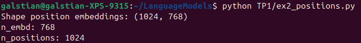

La matrice des embeddings positionnels a une shape (1024, 768). La première dimension (1024) correspond au nombre de positions possibles prises en compte par GPT-2, et la deuxième (768) correspond à la taille du vecteur d’embedding. Donc chaque position 0, 1, 2, … est associée à un vecteur de 768 valeurs.

n_positions = 1024 correspond au contexte maximum : pour un modèle de langage causal comme GPT-2, ça veut dire qu’il est prévu pour traiter au plus 1024 tokens dans l’entrée (au-delà, il faudrait tronquer ou gérer autrement).

Question 3.b : 

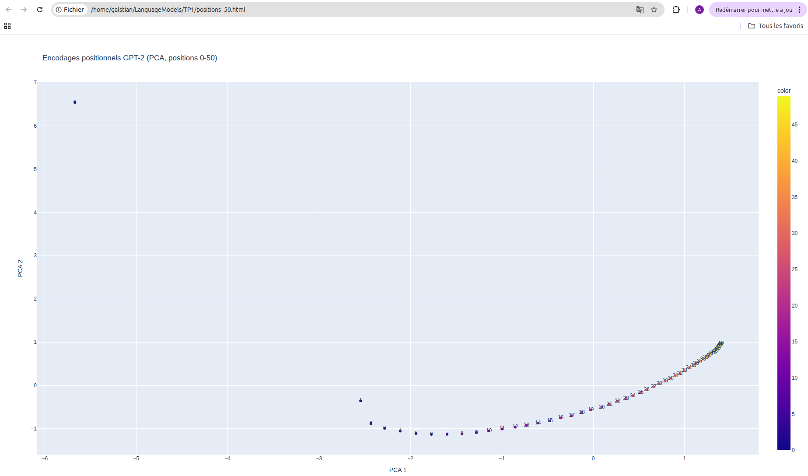

Sur la visualisation PCA des positions 0 à 50, on observe que les points suivent globalement une courbe continue, ce qui montre que les embeddings positionnels évoluent progressivement quand la position augmente. Les positions successives sont proches les unes des autres dans l’espace projeté, ce qui indique que des positions proches ont des représentations similaires.

On remarque toutefois quelques points plus éloignés du reste du nuage, notamment pour les toutes premières positions, ce qui peut s’expliquer par un comportement particulier du modèle au début des séquences. Globalement, la structure est assez lisible sur cette plage réduite, et l’ordre des positions reste visuellement cohérent.

La PCA est utilisée ici car les embeddings positionnels sont en dimension 768, ce qui ne permet pas une visualisation directe. La projection en 2D permet de mieux comprendre la structure globale et les relations entre positions, même si une partie de l’information est forcément perdue.

Question 3.c : 

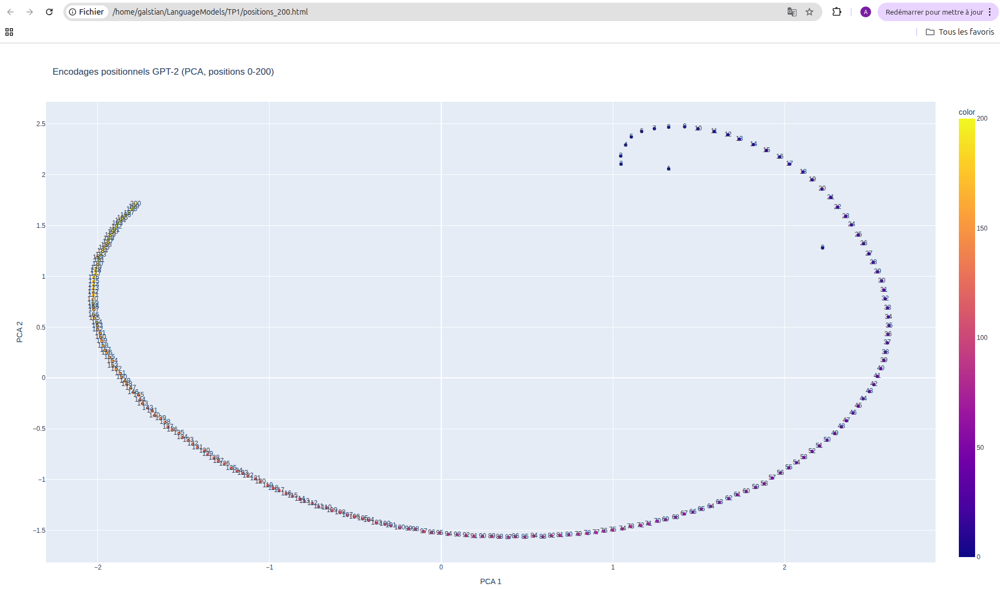

Lorsque l’on étend la visualisation aux positions 0 à 200, la structure globale reste visible mais devient plus complexe. Les points suivent une forme courbe plus large, presque circulaire, ce qui suggère une organisation plus riche des embeddings positionnels sur une plage plus longue.

Comparé au cas 0–50, le nuage est beaucoup plus dense et les points se chevauchent davantage, ce qui rend la lecture de l’ordre exact des positions plus difficile. La continuité est toujours présente, mais elle est moins évidente à cause de la projection en 2D et du nombre plus élevé de positions affichées.

Une hypothèse est que GPT-2 apprend des encodages positionnels qui varient de manière régulière mais non linéaire dans l’espace des embeddings. Sur une plage courte (0–50), cette variation apparaît presque comme une simple trajectoire, tandis que sur une plage plus longue (0–200), la structure devient plus étendue et difficile à projeter correctement en deux dimensions.

Cela suggère que l’information de position est encodée de façon distribuée sur plusieurs dimensions, et que la PCA ne capture qu’une partie de cette structure. Malgré cela, le fait que l’on observe une forme organisée plutôt qu’un nuage aléatoire montre que les positions sont représentées de manière cohérente et exploitable par le mécanisme d’attention.

Exercice 4 :

Question 4.a : 

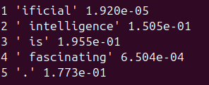

Dans GPT-2, le modèle est entraîné de manière causale : à chaque position, il prédit le token suivant à partir des tokens précédents. Les logits à la position t-1 correspondent donc à la prédiction du token t. C’est pour cette raison que la probabilité du token observé à l’index t est lue dans logits[t-1]. Le premier token n’est pas évalué car il n’a pas de contexte précédent.

Question 4.b : 

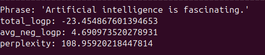

La perplexité mesure à quel point une phrase est probable selon le modèle. Intuitivement, elle correspond au “nombre moyen de choix” que le modèle hésite à chaque étape. Une perplexité faible signifie que le modèle attribue des probabilités élevées aux tokens observés, donc que la phrase est conforme aux régularités apprises pendant l’entraînement. À l’inverse, une perplexité élevée indique que plusieurs tokens sont peu probables conditionnellement, ce qui rend la phrase plus surprenante pour le modèle. La perplexité est souvent utilisée pour comparer différentes phrases ou différents modèles de langage.

Question 4.c : 

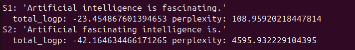

On observe que la phrase grammaticalement correcte a une perplexité beaucoup plus faible que la phrase avec un ordre de mots incorrect. La seconde phrase viole des régularités syntaxiques simples (ordre des mots, position du verbe), ce qui fait chuter les probabilités conditionnelles de plusieurs tokens. Comme GPT-2 est entraîné sur de grandes quantités de texte naturel, il a appris ces régularités, ce qui se reflète directement dans l’écart très important de perplexité entre les deux phrases.

Question 4.d : 

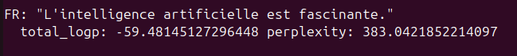

La perplexité de la phrase en français est plus élevée que celle de la phrase anglaise correcte, mais nettement plus faible que celle de la phrase anglaise incorrecte. Cela s’explique par le fait que GPT-2 est majoritairement entraîné sur de l’anglais, donc il attribue en général des probabilités plus faibles aux tokens français. La tokenisation en sous-mots peut aussi être moins efficace en français, ce qui réduit encore les probabilités conditionnelles.

Question 4.e : 

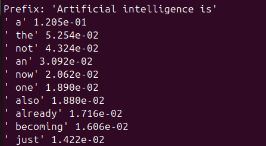

Les tokens proposés sont plausibles après le préfixe “Artificial intelligence is”. On observe que la plupart commencent par un espace, ce qui est cohérent avec la tokenisation de GPT-2. Les mots proposés correspondent à des continuations fréquentes dans le langage naturel (articles, adverbes, verbes), ce qui montre que le modèle a appris des structures syntaxiques et sémantiques réalistes.

Exercice 5 :

Question 5.a : 

J’ai fixé le seed à 42 au début pour rendre l’expérience plus reproductible. Dès qu’on utilise du sampling, le modèle tire des tokens au hasard selon la distribution, donc sans seed les sorties changent à chaque exécution. Fixer un seed permet d’obtenir les mêmes sorties à paramètres identiques, ce qui facilite la comparaison entre méthodes.

Question 5.b : 

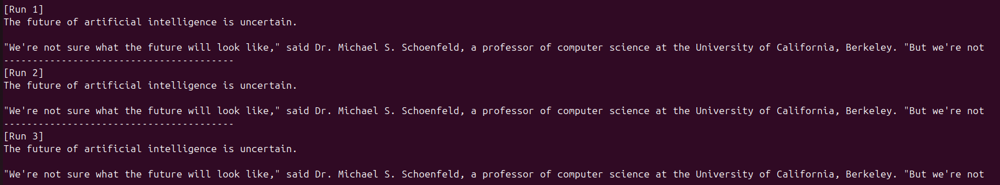

J’ai relancé 3 fois et la sortie est strictement identique. C’est normal car le greedy decoding est déterministe : à chaque étape, le modèle prend le token le plus probable. Tant que le prompt, le modèle et les paramètres ne changent pas, on obtient la même génération.

Question 5.c : 

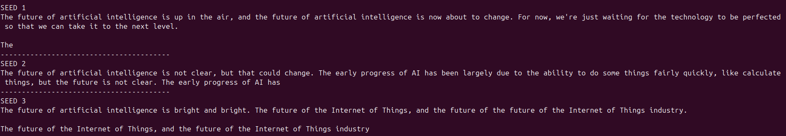

Par rapport au greedy, le sampling produit des sorties beaucoup plus variées : selon le seed, le texte change fortement. On voit que certaines générations restent assez cohérentes (ex: seed 5), mais d’autres deviennent plus répétitives ou partent dans des formulations étranges (ex: seed 3 avec “future of the future”). Globalement, on gagne en diversité mais on perd un peu en stabilité. Le greedy donne une continuation plus “safe” et journalistique, alors que le sampling peut produire des répétitions ou des ruptures de style.

La température, elle, contrôle le niveau d’aléatoire : plus elle est basse, plus on se rapproche du greedy (choix très probables), plus elle est haute, plus on prend des tokens moins probables. Top-k limite le choix aux k tokens les plus probables, et top-p limite à un ensemble de tokens couvrant une probabilité cumulée p. Les deux servent à éviter de tirer des tokens trop improbables, tout en gardant de la diversité.

Question 5.d : 

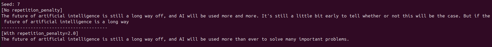

Avec la pénalité de répétition, on observe moins de répétitions immédiates (“more and more”, et répétition de segments). Le texte devient aussi plus court et plus direct, comme si le modèle évitait de repartir dans des boucles. L’effet secondaire possible est que parfois ça “coupe” certaines formulations ou rend la suite plus sèche, surtout si la pénalité est élevée.

Question 5.e : 

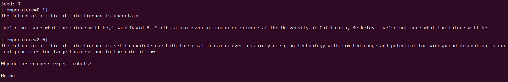

À température très basse (0.1), la génération devient très conservative : ça ressemble beaucoup au greedy, avec un style assez classique et cohérent (journalistique, citations, etc.). À température très haute (2.0), la génération devient nettement plus “créative” mais aussi moins stable : on voit des ruptures (“Why do researchers expect robots? Human”) et une cohérence globale plus fragile. Donc la température est un vrai compromis : basse = plus cohérent mais plus répétitif/générique, haute = plus divers mais plus risqué.

Question 5.f : 

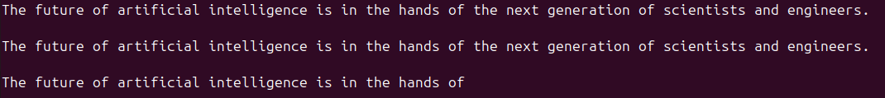

Le beam search donne une phrase très “propre” et plausible, mais on remarque que ça devient vite très répétitif ici (la même phrase revient plusieurs fois). Comparé au sampling, c’est beaucoup moins divers et plus générique. Comparé au greedy, ça cherche une suite globalement probable, mais ça peut aussi tomber dans des répétitions si plusieurs beams convergent vers la même suite.

Question 5.g : 

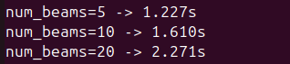

Plus num_beams augmente, plus la génération est lente car le modèle doit garder et évaluer plusieurs séquences candidates à chaque étape. En pratique, on explore plus de chemins dans l’arbre de génération, donc le coût augmente avec le nombre de beams (et la longueur). C’est pour ça que beam search est plus cher que greedy, et devient vite coûteux quand on monte à 10 ou 20 beams.

