# TP2 — Modèles de langage 

Reproductibilité : 

Pour assurer la reproductibilité des expériences, nous avons fixé le seed aléatoire à 42 pour Python, NumPy et PyTorch.

Question 1 : 

1. Alexandre Galstian

2. 
bash
python -m venv .venv
source .venv/bin/activate
pip install -r TP1/requirements.txt

3. 
Python: 3.12.12
OS: Linux-6.14.0-37-generic-x86_64-with-glibc2.39
torch: 2.9.1+cu128
tensorflow: 2.20.0
tiktoken: 0.12.0
pandas: 2.3.3
matplotlib: 3.10.8

Question 2 : 

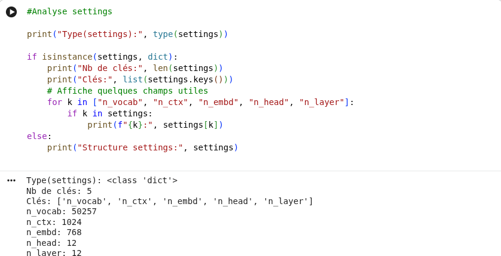

settings est un dictionnaire Python (dict). Il contient 5 clés : ['n_vocab', 'n_ctx', 'n_embd', 'n_head', 'n_layer']. Ces champs correspondent aux hyperparamètres principaux du GPT-2 124M : taille du vocabulaire (50257), longueur de contexte max (1024), dimension des embeddings (768), nombre de têtes d’attention (12) et nombre de couches Transformer (12).

Question 3 : 

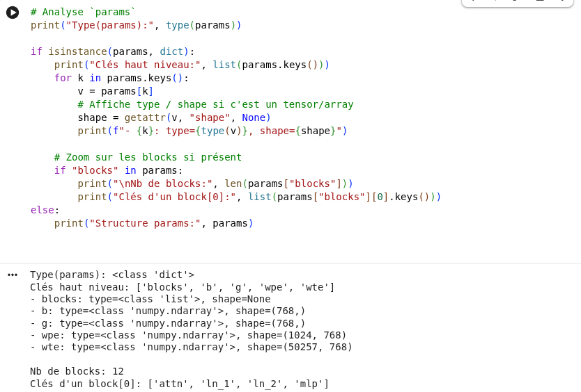

params est aussi un dictionnaire Python (dict) qui contient les poids du modèle. Les clés de haut niveau sont ['blocks', 'b', 'g', 'wpe', 'wte'].

wte est la matrice d’embeddings de tokens de shape (50257, 768),

wpe est la matrice d’embeddings positionnels de shape (1024, 768),

b et g sont des vecteurs de shape (768,) (utilisés pour la normalisation),

blocks est une liste de longueur 12 (une entrée par couche Transformer), et chaque block contient ['attn', 'ln_1', 'ln_2', 'mlp'] (attention, normalisations, MLP).

Question 4 :

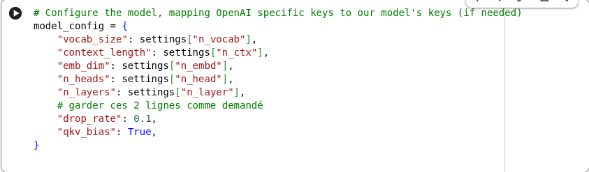

Dans GPTModel.__init__, cfg doit être un dictionnaire contenant les dimensions du modèle (vocab_size, emb_dim, context_length) ainsi que les paramètres d’architecture (n_layers, n_heads) et dropout. La variable settings est bien un dict, mais ses clés sont au format GPT-2 OpenAI (n_vocab, n_ctx, n_embd, n_head, n_layer). On fait donc un mapping vers un nouveau dict model_config avec les noms attendus par GPTModel

Question 5.1 : 

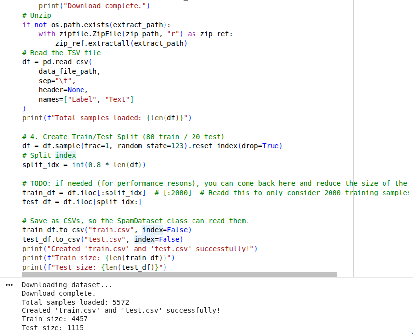

On fait df.sample(frac=1, random_state=123) pour mélanger aléatoirement le dataset avant de faire la séparation train/test. Comme le fichier original peut être trié ou avoir un certain ordre, shuffler évite d’avoir un split biaisé (par exemple trop de spams d’un côté). Le random_state permet que le mélange soit reproductible : on retrouve le même split si on relance.

Question 5.2 : 

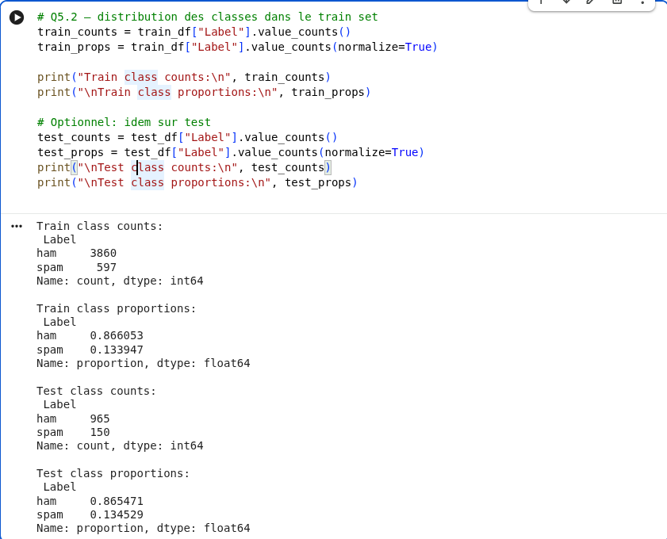

Dans le jeu d’entraînement, on observe que la classe ham est largement majoritaire avec 3860 messages (≈ 86.6 %), contre 597 messages spam (≈ 13.4 %). Le jeu de test présente une distribution très similaire, avec environ 86.5 % de ham et 13.5 % de spam.

Le dataset est donc clairement déséquilibré. Ce déséquilibre peut poser problème lors du fine-tuning, car le modèle peut avoir tendance à privilégier la classe majoritaire et obtenir une bonne accuracy tout en détectant mal les spams. Il faudra donc être attentif aux métriques d’évaluation, en particulier le rappel (recall) et le F1-score pour la classe spam.

Question 6 :

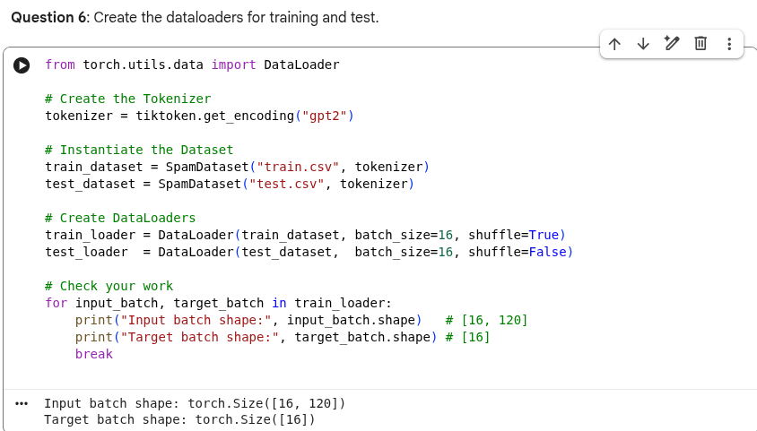

Les DataLoaders ont bien été créés avec batch_size=16. Un batch a la forme [16, 120] pour les IDs (messages paddés à 120 tokens) et [16] pour les labels.

Question 7 : 

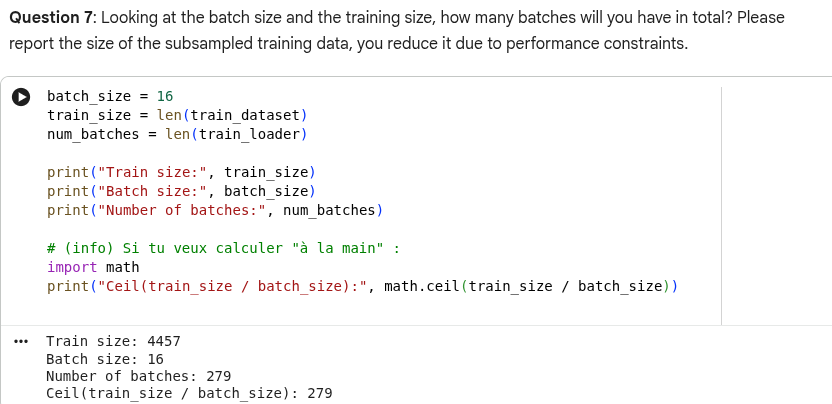

Le jeu d’entraînement contient 4457 exemples et le batch size est fixé à 16. Cela conduit à 279 batches au total, ce qui correspond bien à la valeur ceil(4457 / 16) = 279.

Dans cette partie, nous avons utilisé l’ensemble complet du jeu d’entraînement (sans sous-échantillonnage), ce qui permet d’exploiter toutes les données disponibles pour le fine-tuning.

Question 8 : 

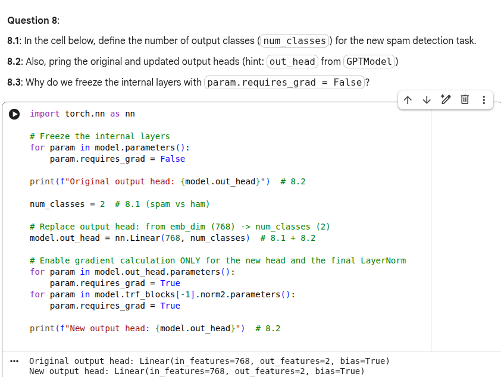

La tâche est une classification binaire (spam vs ham), donc on définit num_classes = 2.

Ici, l’affichage “original head” et “new head” donne la même structure (Linear(768 → 2)). Cela vient du fait que, au moment où j’ai imprimé la head “originale”, elle avait déjà été remplacée (par exemple parce que la cellule a été relancée ou exécutée dans un ordre où model.out_head avait déjà été modifié). L’objectif reste le même : remplacer la couche de sortie pour passer d’une prédiction sur le vocabulaire (pré-training) à une prédiction sur 2 classes (spam/ham).

Concernant les couches internes, On les gèle (requires_grad=False) pour éviter de ré-entraîner tout GPT-2 sur un petit dataset. On ne met à jour que la head de classification (et ici une LayerNorm finale) afin d’adapter le modèle à la tâche spam/ham. Cela réduit fortement le coût de calcul et limite le risque d’overfitting, tout en profitant des représentations déjà apprises pendant le pré-entraînement.

Question 9 : 

Pour des raisons de temps de calcul, l’entraînement a été limité à 1 epoch sur le dataset complet (4457 exemples, batch_size=16).

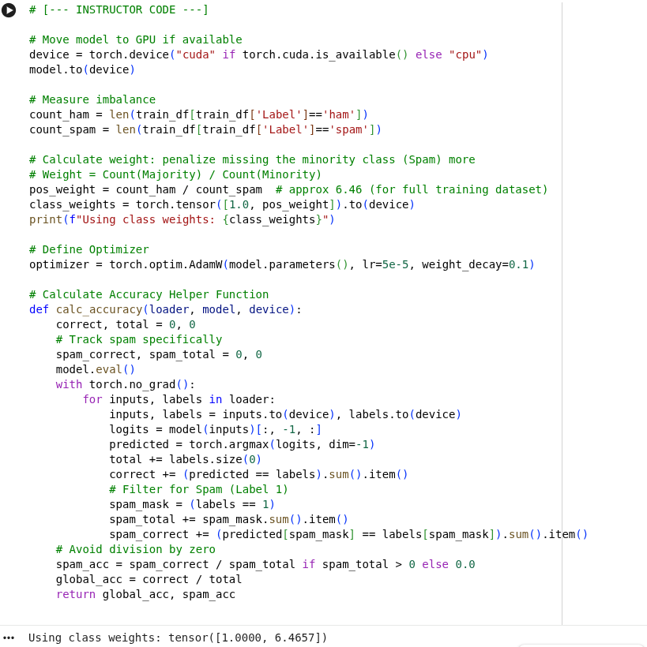

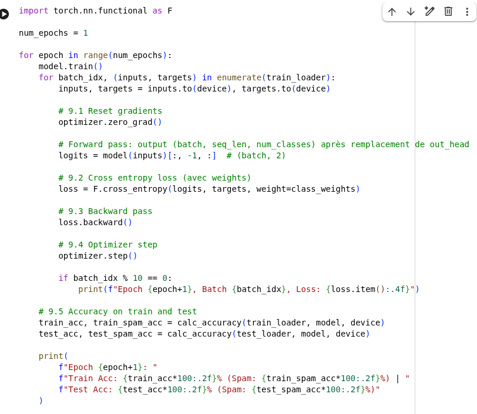

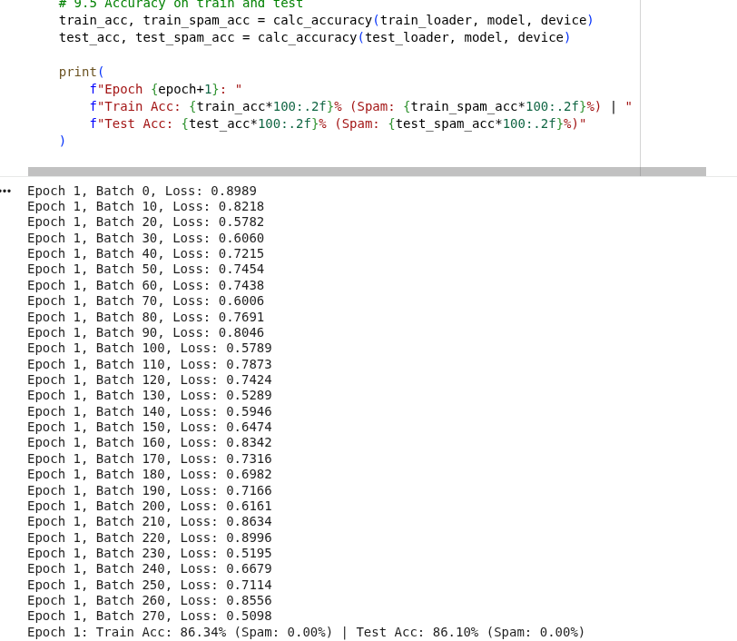

Question 10 : 

Au cours de l’epoch d’entraînement, la valeur de la loss fluctue d’un batch à l’autre mais reste globalement comprise entre environ 0.5 et 0.9. On observe une légère tendance à la stabilisation par rapport aux premiers batches, ce qui indique que la nouvelle tête de classification commence à s’adapter à la tâche.

En fin d’epoch, l’accuracy globale atteint environ 86 % sur le jeu d’entraînement et 86 % sur le jeu de test. Ces valeurs sont proches, ce qui suggère une absence de surapprentissage à ce stade.

En revanche, l’accuracy sur la classe spam est de 0 %, ce qui montre que le modèle prédit essentiellement la classe majoritaire (ham). Cela s’explique par le fort déséquilibre du dataset et par le fait que l’entraînement a été limité à un seul epoch, ce qui n’est pas suffisant pour apprendre correctement la classe minoritaire.

Question 10 : 

Une augmentation du nombre d’epochs ou une réduction du déséquilibre effectif (par exemple via davantage d’epochs ou un sous-échantillonnage) permettrait probablement d’améliorer la détection des spams. De même, un entraînement plus long ou l’utilisation d’un GPU faciliterait l’apprentissage de la classe minoritaire, comme suggéré par la loss pondérée utilisée.
