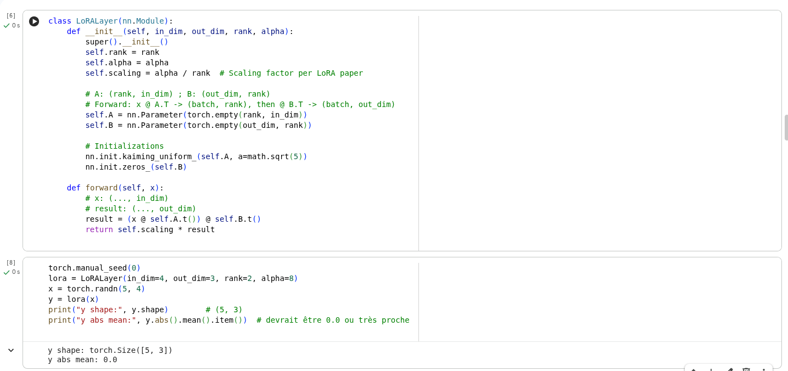
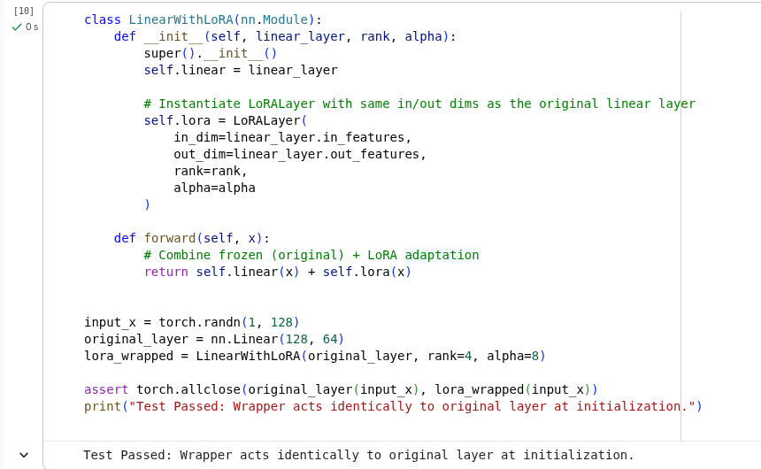
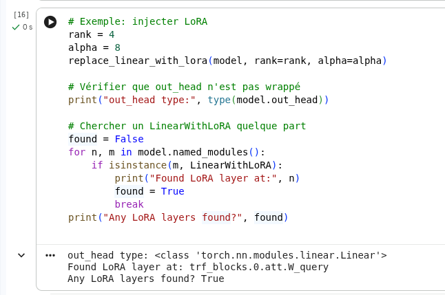
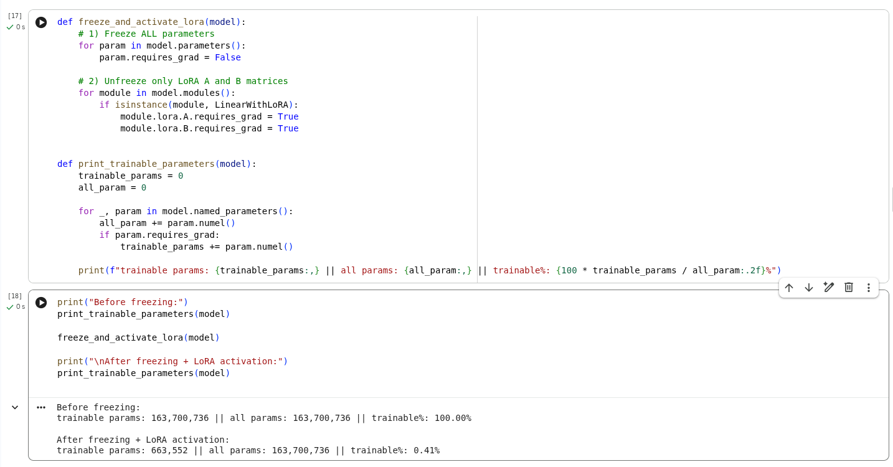
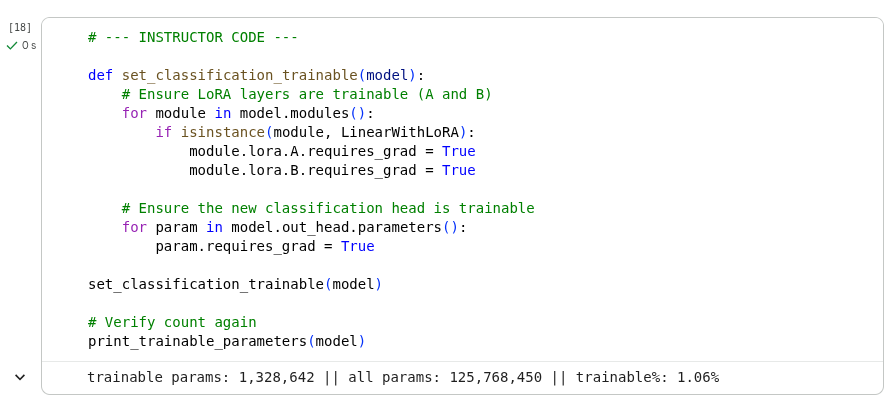
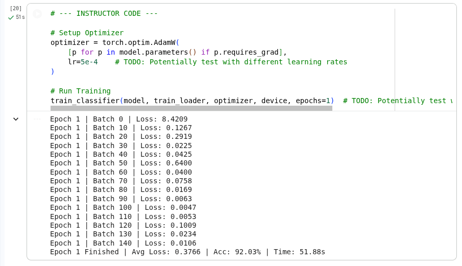
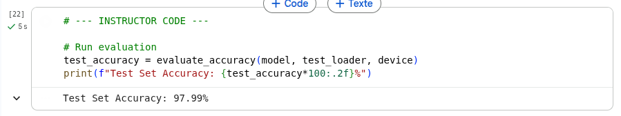

# TP3 — Modèles de langage 

Exercice 1 : 

J’ai implémenté un module LoRALayer qui calcule uniquement la branche d’adaptation.

A est initialisée avec une initialisation type Kaiming (pour éviter des valeurs trop petites/grandes), et B est initialisée à zéro pour que l’adaptation soit nulle au départ : le modèle se comporte initialement comme le modèle pré-entraîné.

Test rapide de la couche LoRA :

La shape (5, 3) confirme que la couche transforme bien un batch de 5 vecteurs d’entrée en sortie de dimension out_dim=3. Le fait que la moyenne absolue soit 0.0 est cohérent avec l’initialisation de LoRA : comme B est initialisé à zéro, la contribution (BAx) est nulle au départ, donc la couche LoRA ne modifie pas le comportement initial du modèle. L’adaptation apparaît seulement après entraînement.

Exercice 2 : 

J’ai créé un wrapper LinearWithLoRA qui combine la couche linéaire originale et la branche LoRA. Le forward renvoie linear(x) + lora(x). Comme B est initialisé à zéro, la sortie du wrapper est identique à celle de la couche originale au départ, ce qui a été vérifié avec le test d’égalité (torch.allclose). Ensuite, pendant le fine-tuning, seuls les paramètres LoRA sont entraînés, ce qui rend l’adaptation plus légère.

Retour du code : 

Exercice 3 : 

Pour injecter LoRA dans GPTModel sans réécrire toute la classe, j’ai écrit une fonction récursive qui parcourt les sous-modules avec named_children(). À chaque fois qu’un module est un nn.Linear, je le remplace par un wrapper LinearWithLoRA. J’ai exclu la couche finale out_head car elle projette vers le vocabulaire et on évite généralement de la modifier dans ce TP. Cette approche permet d’activer LoRA dans tout le Transformer de manière automatique.

Test d'injection : 

Cette vérification montre que la fonction d’injection a bien remplacé des couches nn.Linear par LinearWithLoRA dans le modèle. On détecte par exemple une couche LoRA au niveau de trf_blocks.0.att.W_query, donc dans l’attention d’un bloc Transformer.
En même temps, la couche finale out_head reste un nn.Linear, ce qui est conforme à la consigne de ne pas appliquer LoRA sur la projection finale vers le vocabulaire. On a donc bien une injection LoRA “partielle” du modèle, sans modifier la couche de sortie.

Exercice 4 : 

Test de freeze et compte des paramètres : 

Avant le gel, tous les paramètres du GPT étaient entraînables (100%), ce qui correspond à un fine-tuning complet. Après application de freeze_and_activate_lora, l’ensemble du modèle est gelé, et seuls les paramètres LoRA A et B restent entraînables.
On obtient 663 552 paramètres entraînables sur 163 700 736, soit seulement 0.41%. Cela confirme l’intérêt de LoRA : on peut adapter un modèle très large en entraînant une fraction minime des poids, ce qui réduit fortement le coût mémoire et le temps de fine-tuning.

Question 1 : 

Oui, on voit clairement une différence. Avant injection, les projections de l’attention (W_query, W_key, W_value, out_proj) ainsi que les couches du feed-forward sont des nn.Linear classiques. Après application de replace_linear_with_lora, ces couches sont remplacées par LinearWithLoRA, qui encapsule la couche originale (linear) et ajoute une branche LoRA (lora).
On garde exactement la même architecture globale du Transformer, mais on ajoute une composante entraînable de faible rang sur les couches linéaires internes. On observe donc explicitement LinearWithLoRA(...) à plusieurs endroits du bloc.

Question 2 : 

Après injection LoRA (rank=8, alpha=16) et gel des poids, on obtient :
- Paramètres entraînables : 1 327 104
- Paramètres totaux : 164 364 288
- Fraction entraînable : 0.81%

Cela confirme que LoRA permet de fine-tuner le modèle en n’entraînant qu’une petite fraction des paramètres, ce qui réduit fortement le coût mémoire et computationnel par rapport à un fine-tuning complet.

Question 3 : 

Après avoir remplacé out_head par une head de classification (2 classes) et réactivé l’entraînement de cette head en plus des paramètres LoRA, le nombre de paramètres entraînables augmente légèrement. On passe à 1 328 642 paramètres entraînables, soit 1.06% du modèle.
Cette différence est logique : en plus des matrices LoRA A et B, on entraîne maintenant aussi les paramètres de la nouvelle couche linéaire de classification (out_head). Malgré cela, on reste très loin d’un fine-tuning complet, donc l’approche reste “parameter-efficient”.

Question 4 : 

La loss diminue très fortement au cours de l’entraînement : elle est très élevée au début (Batch 0 à 8.42), puis chute rapidement à des valeurs faibles (souvent proches de 0.0x après quelques batches). Cela indique que le modèle apprend très vite sur cette tâche.
L’accuracy finale sur le train est de 92.03%, ce qui est cohérent avec un problème de classification binaire sur un dataset relativement simple (spam vs ham), surtout après équilibrage des classes.
La perte moyenne à la fin de l’epoch (0.3766) confirme que le fine-tuning a bien convergé en seulement 1 epoch, probablement aidé par le fait que GPT-2 a déjà des représentations linguistiques riches et que seules quelques couches (LoRA + head) sont adaptées.

Question 5 : 

L’accuracy sur le jeu de test est de 97.99%, ce qui est supérieure à celle du train (92.03%). Cela peut arriver à cause du hasard du split (le test peut être légèrement plus “facile”), et du fait que le dataset est relativement petit (299 exemples).
Globalement, cette accuracy est très élevée et montre que le modèle généralise bien sur les messages de test. Comme les classes ont été équilibrées, ce score est aussi plus représentatif que sur un dataset très déséquilibré, où une accuracy élevée peut être trompeuse.
