# TP4 — Modèles de langage 

Exercice 1 : 

Question 1.a : 

J'ai fait le choix de l'option A

Question 1: 

- Port choisi : 11434
- Modèle : mistral:instruct
- Mode : Option A (local)

Curl de l'ip avec le port : 

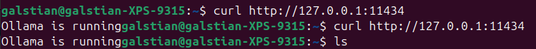

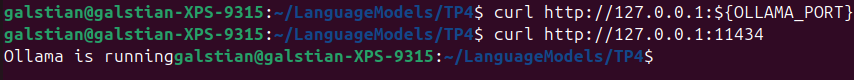

Résultat de ollama run MODEL_NAME ... :

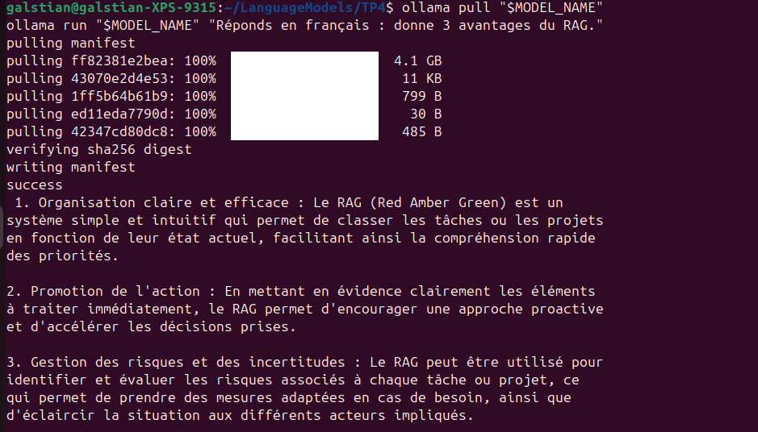

Question 2 :

Résultat de la commande tree -a ... : 

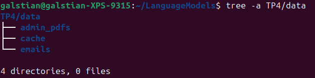

Présence des pdf et installation des dépendances : 

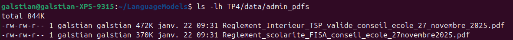

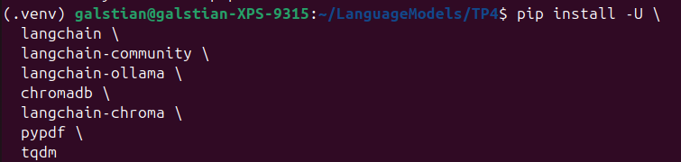

Nombre de fichiers créés dans TP4/data/emails/ : 

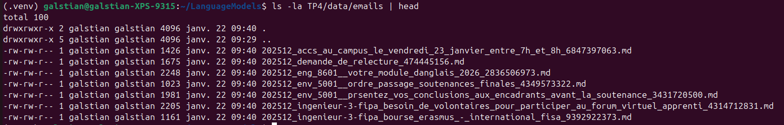

Contenu d’un email (début du fichier) avec head : 

Question 3 :

Sortie console de python TP4/build_index.py (nb docs + nb chunks) : 

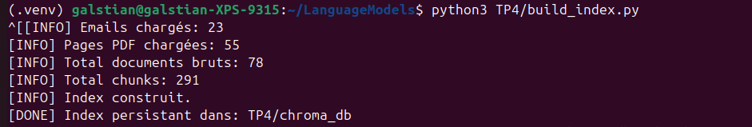

ls -la TP4/chroma_db prouvant que l’index est créé

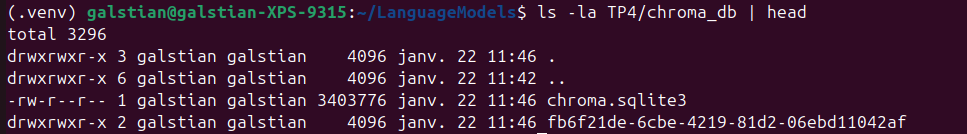

Question 4 : 

Retrieval sans LLM (TOP_K=5, embeddings = nomic-embed-text-v2-moe) : 

Pour la question sur les sujets de PFE, le 1er résultat est l’email “PFE: Sujets additionnels”, qui contient déjà l’introduction indiquant qu’il s’agit des sujets proposés par Luca Benedetto. Les résultats suivants contiennent un peu de bruit (emails hors-sujet, PDF génériques), mais la réponse est récupérée dès le top-1.
Pour la question “Comment valider une UE ?”, les résultats proviennent du règlement de scolarité (PDF), et le top-1 contient directement la section “Validation des UE” avec la définition de la note finale (moyenne pondérée). On observe cependant de la redondance : plusieurs chunks du même PDF remontent. Un TOP_K plus petit (ex: 3) pourrait suffire en phase RAG pour limiter le bruit.

Commande exécutée (au moins une question) et les 3 premiers résultats (sources + extraits) :

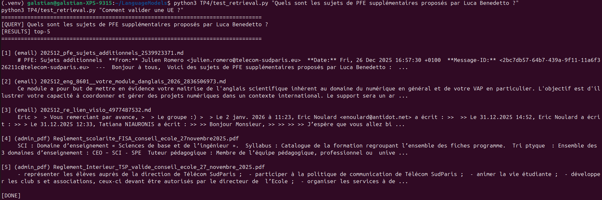

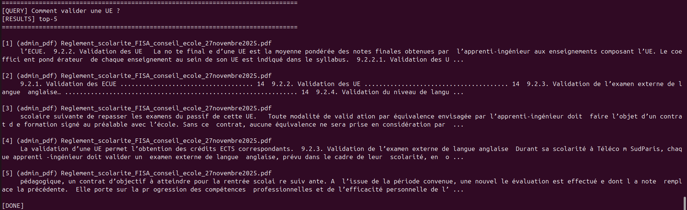

Valeur de TOP_K :

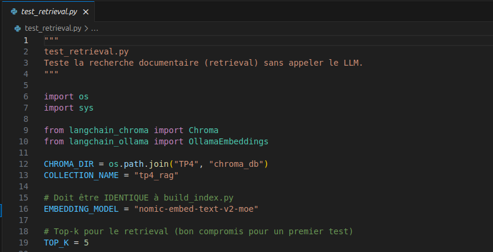

Question 5 : 

Exécution complète de TP4/rag_answer.py : 

- Deux premières questions avec informations connues : 

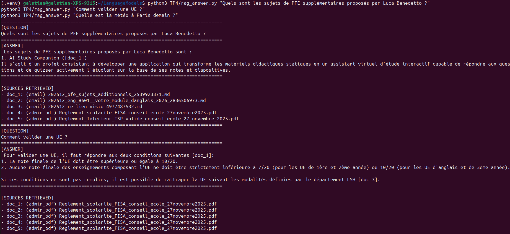

- Dernière question avec informations inconnues : 

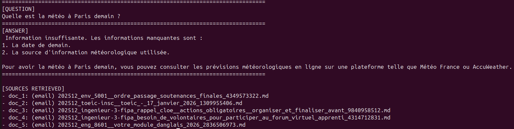

Question 6 : 

q1 — “Quels sont les sujets de PFE supplémentaires… ?”

Score : 1/2

Réponse partielle, mais pas d’hallucination. Réponse sourcée et en francais, mais incomplète car qu'un seul sujet donné.

q2 — “Comment valider une UE ?”

Score : 2/2

Réponse claire et actionnable (seuil de 10/20, contraintes de notes minimales, rattrapage) avec les cotations présentes et c'est cohérent avec un règlement de scolarité.

q12 — “procédure exacte pour demander une équivalence…”

Score : 1/2

Le début est crédible et utile (contrat de formation préalable) avec citation mais la suite mélange équivalence et VAE (“jury VAE”, “dossier VAE”, “soutenance”), et cite le règlement intérieur. Ça ressemble à une fusion de passages pas forcément dans le contexte “équivalence”. Donc c'est partiellement correct

- Échec 1 : réponse incomplète (q1)

On a une réponse qui ne donne qu’un seul sujet alors que l’email contient “des sujets” (probablement une liste). Cela est sûrmeent lié à un chunk trop long c'est à dire que le modèle prend le premier item et s’arrête.

L'amélioration proposée serait de réduire CHUNK_SIZE (ex: 600) et augmenter légerement overlap (150) pour isoler la liste, et modifier le prompt : “Si le contexte contient une liste, recopie tous les items présents, sans en inventer.”

- Échec 2 : mélange / confusion “équivalence” vs “VAE” (q12)

La réponse parle de jury VAE + soutenance, alors que la question porte sur une équivalence de validation (ce n’est pas forcément la même procédure). C'est sûrement dû à un retrieval qui renvoie plusieurs chunks qui parlent de validation/équivalence/VAE et le modèle fusionne TOP_K=5 + docs proches donc le modèle peut “combiner” des procédures différentes. L'amélioration proposée serait baisser TOP_K à 3 pour réduire le mélange, ou utiliser un retrieval MMR (diversité) afin d’éviter 5 chunks similaires, et renforcer le prompt : “ne réponds que si tu peux citer une phrase/élément précis du contexte pour chaque étape”.

Fichier questions.json : 

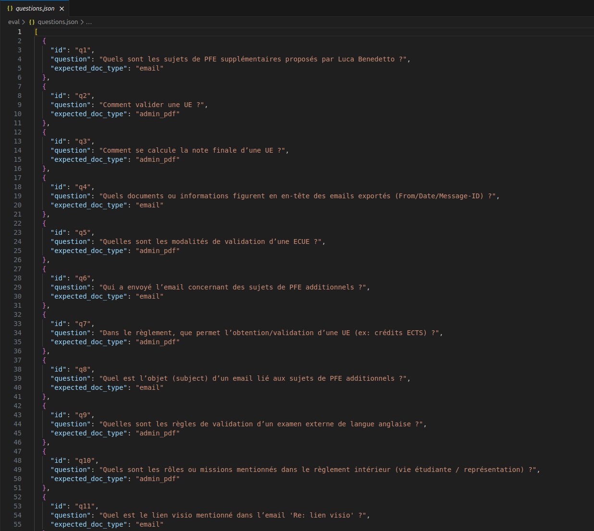

Sortie de python TP4/eval_recall.py avec le score final :

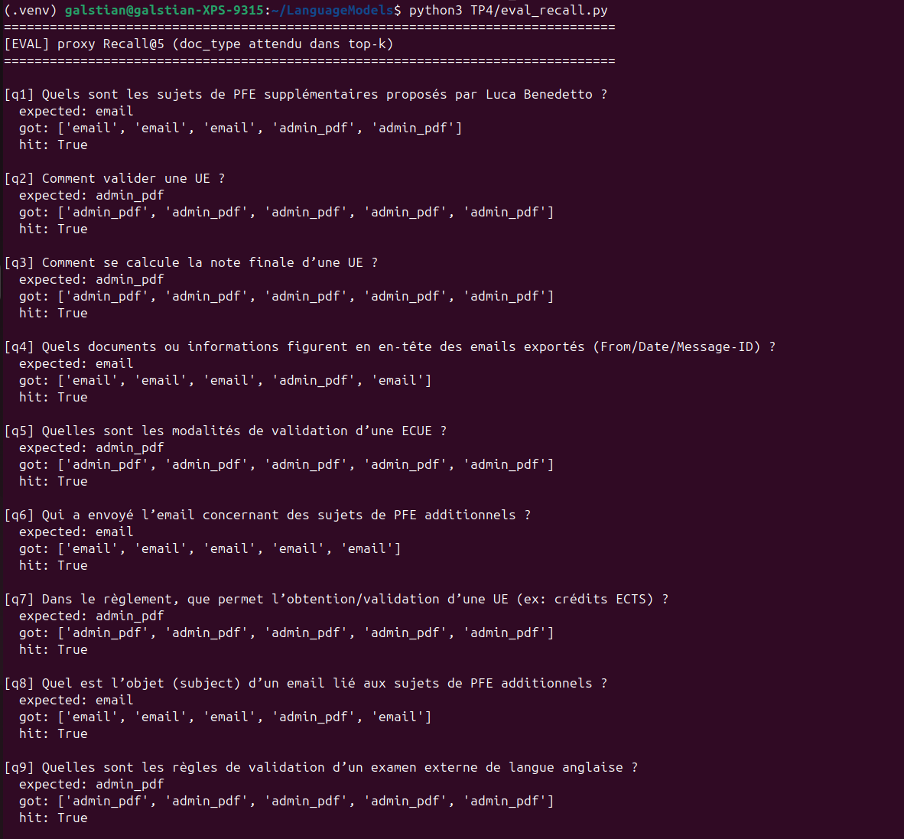

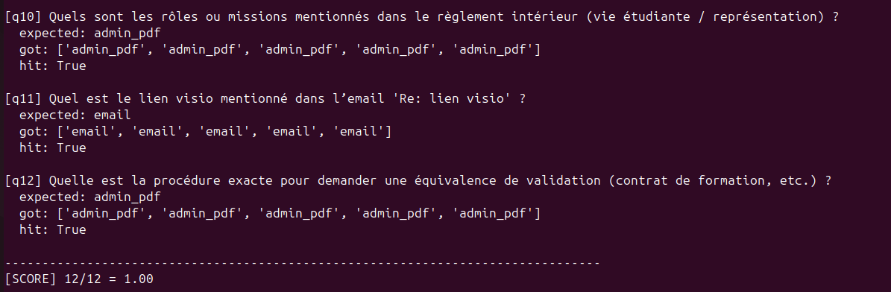

Une exécution de TP4/rag_answer.py :

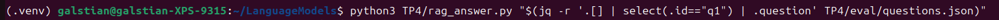

Globalement, l’indexation + retrieval fonctionnent très bien : sur mon mini jeu de 12 questions, le proxy Recall@5 sur le type de document atteint 1.00, ce qui montre que le système retrouve la bonne source (emails vs règlements). Les réponses RAG sont plus fiables grâce aux citations obligatoires et à la règle d’abstention. La principale limite rencontrée est la qualité de génération sur certains cas : réponse incomplète (liste tronquée) ou mélange de procédures proches (équivalence/VAE) quand plusieurs chunks sont récupérés. L’amélioration prioritaire serait de réduire le bruit (TOP_K=3 ou MMR) et d’ajuster le chunking/prompt pour forcer l’extraction exhaustive des listes sans inventer.
